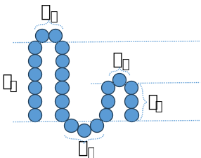

# 

## intercellular and extracellular segments of protein

- $a_i$ is the number of circles in the curve.
- $b_j$ is the number of circles in the vertical direction.
- $x$ is the number of curves.
- $y$ is the number of turns.
$$
x=2y-1
$$
$$
a_i \in \{1,2\}, i=1,2,3,...,x, \text{where } x\in \{1,3,5,…\}
$$
$$
b_j \in \{1,2,3,...,6\}, j=1,2,3,...,y, \text{where } y\in \{1,2,3,…\}
$$
$$
\sum_{i=1}^{x} a_i \;+\; 2\sum_{j=1}^{y} b_j \;=\; N
$$
$$
\min y
$$
Therefor,
$$
N_{min} = x*1+2*(y*1)=2y-1+2*(y*1)=4y-1
$$
$$
N_{max} = (2y-1)*5+2*(y*10)=30y-5
$$
Therefor,
$$
4y-1 \leq N \leq 30y-5
$$


```math
y\leq \frac{N+1}{4}
```

